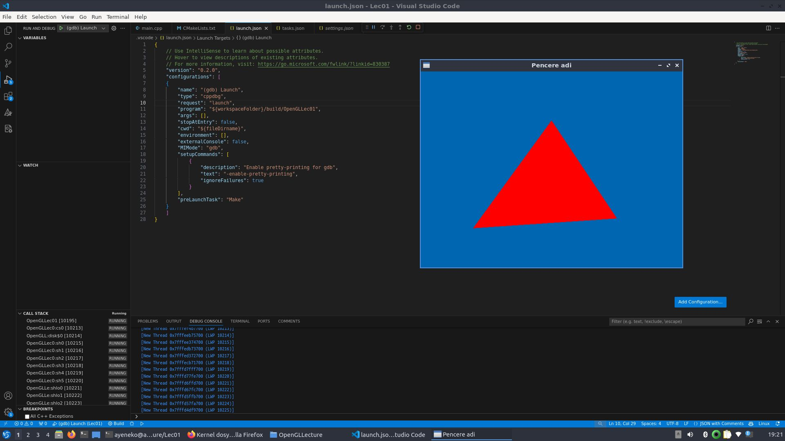

## 🎨 OpenGL Triangle Render - Lec01

Bu proje, modern OpenGL kullanılarak basit bir **kırmızı üçgen** çizimini göstermektedir. `GLFW`, `GLAD` ve `GLM` kütüphaneleri kullanılmıştır. Shader programlama ile GPU üzerinde çalışacak şekilde vertex ve fragment shader'lar yazılmıştır.

---

### 📁 Klasör Yapısı

```
.
├── assets/
│   └── LEC01.png          # Çıktı görseli (kırmızı üçgen)
├── build/                 # Derleme klasörü (otomatik oluşturulur)
├── kutuphane.hpp          # Header dosyası (ileride genişletilebilir)
├── main.cpp               # Ana kaynak dosyası
├── tasks.json             # VSCode için build görevleri
└── launch.json            # VSCode için debug yapılandırması
```

---

### 🖼️ Çıktı Görseli

<p align="center">
  
</p>

---

### 🔺 OpenGL Pipeline Nedir?

OpenGL pipeline, verinin CPU’dan GPU’ya aktarılması ve görselleştirilmesi için geçtiği aşamaların tamamına verilen isimdir. Modern OpenGL pipeline'ında tipik olarak aşağıdaki adımlar izlenir:

1. **Vertex Shader** – Köşe noktalarını işler. Pozisyon, dönüşüm gibi işlemleri burada yaparız.
2. **Primitive Assembly** – Noktaları üçgen, çizgi gibi ilkel yapılara dönüştürür.
3. **Rasterization** – Bu yapılar piksellere çevrilir.
4. **Fragment Shader** – Her pikselin rengi burada hesaplanır.
5. **Output Merger** – Hesaplanan pikseller framebuffer'a yazılır.

---

### ✨ Shader Nedir?

Shader'lar, GPU üzerinde çalışan mini programlardır. Çalışmamızda kullandığımız iki temel shader türü:

- **Vertex Shader:** Köşe (vertex) verilerini işler. Bu projede vertex shader, gelen 3D pozisyonları doğrudan `gl_Position` ile ekran koordinatlarına çeviriyor.
  
  ```glsl
  #version 330 core
  layout (location = 0) in vec3 inPosition;
  void main()
  {
      gl_Position = vec4(inPosition, 1.0);
  }
  ```

| Satır | Açıklama |
|------|----------|
| `#version 330 core` | Shader dilinin sürümünü belirtir. `330` → OpenGL 3.3'e karşılık gelir, `core` ise core-profile'da yazıldığını belirtir (modern OpenGL). |
| `layout (location = 0) in vec3 inPosition;` | Bu satır GPU'ya gönderilen **vertex verisinin** nasıl alınacağını belirtir. <br> - `layout (location = 0)` → Bu verinin 0. konumda olduğunu söyler (VAO ile eşleşir). <br> - `in vec3` → Gelen veri 3 boyutlu vektördür: `x`, `y`, `z` pozisyon bilgisi. <br> - `inPosition` → Değişkenin adı. |
| `void main() { ... }` | Shader'ın çalıştığı ana fonksiyon. Her vertex için bir kez çalışır. |
| `gl_Position = vec4(inPosition, 1.0);` | Her vertex'in ekranda nereye çizileceğini belirler. <br> - `vec4` tipinde olması zorunludur (homojen koordinatlar: x, y, z, w). <br> - `1.0` → w bileşeni (perspektif için gereklidir). |

### 🔺 Not:

- Bu vertex shader, gelen 3D pozisyon bilgisini doğrudan OpenGL'in iç pipeline'ına iletir.
- Yani gelen vertex verisi ekrana aynen aktarılır; herhangi bir dönüşüm (çarpma, kamera vb.) yapılmaz.

Bu shader, temel üçgen çizimi gibi basit uygulamalar için başlangıç noktasıdır.

---

- **Fragment Shader:** Rasterization sonrası oluşan her bir pikselin rengini belirler.
  
  ```glsl
  #version 330 core
  out vec4 fragColor;
  void main()
  {
      fragColor = vec4(1.0f, 0.0f, 0.0f, 1.0f);  // Kırmızı
  }
  ```

Bu projede her pikselin rengi sabit olarak **kırmızı** (`vec4(1.0, 0.0, 0.0, 1.0)`) seçilmiştir.

---

### 🛠️ Build ve Çalıştırma

VSCode üzerinde `tasks.json` ve `launch.json` dosyaları kullanılarak otomatik CMake ve Make yapılandırması yapılmıştır.

**Build etmek için:**

1. `Ctrl+Shift+B` ile "Make" görevini çalıştır.
2. `F5` ile debug modunda başlat.

---

### 💬 Kaynak ve Notlar

- `glfwInit()` ile pencere sistemi başlatılır.
- `gladLoadGLLoader()` fonksiyonu OpenGL fonksiyon işaretçilerini yükler.
- `glCreateShader`, `glCompileShader`, `glAttachShader`, `glLinkProgram` gibi fonksiyonlar shader derlemesi ve programa bağlanması için kullanılır.
- `VAO` (Vertex Array Object) ve `VBO` (Vertex Buffer Object) ile vertex verisi GPU’ya gönderilir.
- `glDrawArrays(GL_TRIANGLES, 0, 3)` komutu ile üç vertex'ten oluşan bir üçgen çizilir.

---

💻 Hazırlayan: Ayşenur Yörür 
<br>🗓️ Tarih: Nisan 2025
