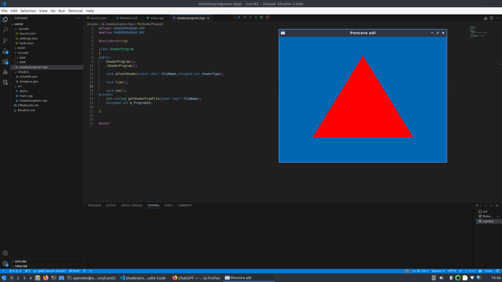

## 🔺 OpenGL Triangle Render - LEC02

Bu proje, bir önceki LEC01 sürümünün geliştirilmiş halidir. Bu versiyonda, **shader programları ayrı dosyalara taşınarak** kodun okunabilirliği ve sürdürülebilirliği artırılmıştır. Ayrıca `ShaderProgram` adında bir sınıf oluşturularak shader yönetimi modüler hale getirilmiştir.

---

### 🆕 Bu Derlemede Neler Geliştirildi?

- ✅ `ShaderProgram` adında bir sınıf oluşturularak shader yükleme ve kullanma işlemleri nesne yönelimli hale getirildi.
- ✅ Shader kaynak kodları (`vertex shader` ve `fragment shader`) ayrı `.glsl` dosyalarına taşındı:
  - `shaders/simplevs.glsl`
  - `shaders/simplefs.glsl`
- ✅ `main.cpp` artık doğrudan shader kodlarını içermiyor; dosya yolunu vererek `ShaderProgram` sınıfı üzerinden yükleniyor.
- ✅ Kod yapısı temizlendi ve yeniden düzenlendi.

---

### 🗂️ Klasör Yapısı

```
LEC02/
├── shaders/
│   ├── simplevs.glsl           # Vertex Shader
│   └── simplefs.glsl           # Fragment Shader
├── include/
│   ├── shaderprogram.hpp       # ShaderProgram sınıfı tanımı
│   └── shaderprogram.cpp       # ShaderProgram sınıfı implemantasyonu
├── src/
│   └── main.cpp                # Uygulamanın giriş noktası
└── README.md                   # Bu döküman
```
<p align="center">
  
</p>

---

### 🧠 Shader Dosyalarını Dışa Alma (Dosyadan Shader Yükleme)

Shader kodları artık `ShaderProgram` sınıfı tarafından `getShaderFromFile()` fonksiyonu aracılığıyla dosyadan okunmaktadır. Bu sayede:

- Shader kodlarını düzenlemek daha kolay.
- Yeniden derleme gerekmeden shader kodları güncellenebilir.
- Kodun yapısı daha temiz ve okunabilirdir.

Örnek kullanım:

```cpp
program.attachShader("../shaders/simplevs.glsl", GL_VERTEX_SHADER);
program.attachShader("../shaders/simplefs.glsl", GL_FRAGMENT_SHADER);
program.link();
```

- Shader dosyaları dışarıdan okunur (yani .glsl dosyasından).
- GL_VERTEX_SHADER veya GL_FRAGMENT_SHADER olarak derlenir.
- Ardından birleştirilip (link) GPU’ya yüklenir.

---

### 🖼️ Uygulama Çıktısı

Bu projede yine bir **kırmızı üçgen** çizilmektedir. Ancak yapı daha modülerdir ve büyük projelere temel oluşturacak hale getirilmiştir.

---

### 🛠️ Derleme Talimatları

1. VSCode üzerinden `Ctrl+Shift+B` ile build işlemini başlat.
2. Shader dosyalarının doğru dizinde olduğuna emin ol (`../shaders/` yoluyla çağrılıyor).
3. Programı çalıştırarak pencere üzerinde üçgen çizimini görebilirsin.

---

🌸Hazırlayan: Ayşenur   
🗓️ Tarih: Nisan 2025
